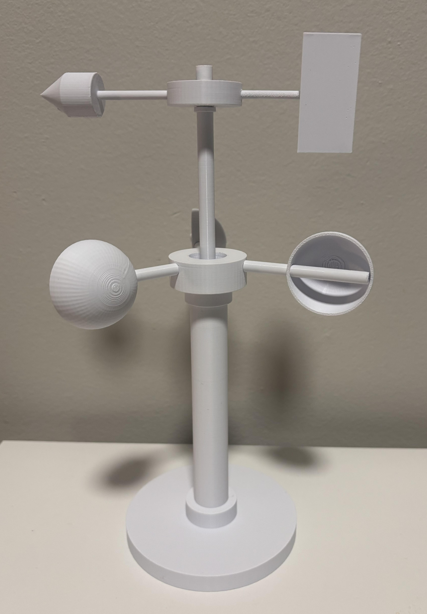

# 3D-Printed Anemometer & Weather Vane Mechanism

A dual-axis mechanical wind measurement instrument consisting of 12 CAD-designed components modeled in OnShape and 3D-printed on a Bambu Lab printer. This repository contains the CAD models, STL assets, and assembly breakdown for low-friction rotary fluid-dynamic mechanisms.

---

## 🛠️ Project Overview

This project combines a rotational **cup anemometer** (to gauge wind velocity) and a **wind vane** (to indicate wind direction) into a single vertical tower assembly. 

* **Components:** 12 parametric CAD parts designed in OnShape
* **Slicer / Printer:** Bambu Studio & Bambu Lab 3D Printer
* **Key Focus:** Concentric shaft alignment, low-friction bearing seating, and aerodynamic cup/fin balancing.

---

## ⚙️ Hardware & Materials

* **3D Printer:** Bambu Lab 3D Printer
* **Slicer:** Bambu Studio
* **CAD Software:** OnShape
* **Material:** PLA / PETG

---

## 📂 Component & CAD Inventory

The system is composed of 12 custom parts designed for modular assembly:

| Category | Component Name | Function / Description |
| :--- | :--- | :--- |
| **Base & Structural** | `base-p4` | Weighted, wide-footprint support platform |
| | `vertical_column` | Central structural housing column |
| | `bearing_seat` | Precise ring mount for low-friction rotary motion |
| **Anemometer System** | `rotor_hub` | Tri-arm central hub for wind cups |
| | `cup_arm` | Radial extension rods connecting hub to cups |
| | `cup2` | Hemispherical drag-capture cups |
| **Wind Vane System** | `vane_rotor` | Top rotating housing hub |
| | `vane_arrow` | Aerodynamic pointer nose cone |
| | `vane_arrow2` | Secondary pointer tip extension |
| | `vane_bottom2` | Tail fin for direction alignment |
| **Shaft Assembly** | `main_shaft` | Primary vertical axle |
| | `main_shaft3` | Upper coaxial extension axle |

---

## 💡 Engineering Insights

* **Rotary Friction Management:** The integration of custom `bearing_seat` components ensures the independent concentric rotation of both the lower anemometer cups and the upper wind vane.
* **Aerodynamic Balance:** The tail fin (`vane_bottom2`) and counterweight arrow tip (`vane_arrow`) were dimensioned to balance around the central `vane_rotor` pivot axis for sensitive response to ambient air currents.

---

## 📂 Repository Structure

```text
├── STL Files/              # 3D Printable STL files (12 components)
│   ├── Anemometer/
│   └── Vane/
├── media/                  # Assembly photos and media
│   └── anemometer_assembly.jpg
└── README.md               # Project documentation
```

<p align="center">
  
</p>
